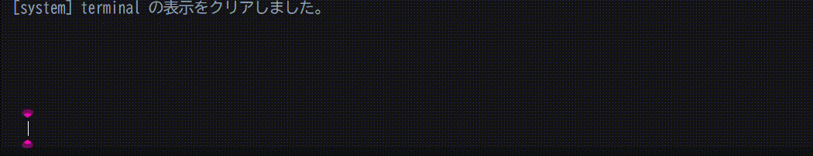

# **pokemon-SnapCrop**

**pokemon-SnapCrop** は、「Pokémon Champions」において、対戦中の自分 / 相手のパーティを自動で撮影 / 表示することができるアプリです。 
下部のコマンド入力欄に、コマンドを入力し操作 / ポケモンの情報を調べることができます。トラブルに対するサポートチャットは[こちら](https://chatgpt.com/g/g-69e6262f0edc8191b991191368c625c6-snapcrop-sahototiyatuto)から。

## 公開URL
[https://suisui-swimmy.github.io/pokemon-SnapCrop/](https://suisui-swimmy.github.io/pokemon-SnapCrop/)

## 推奨環境
- Windows / Google Chrome ( Microsoft Edge では動作が重くなることがあります )
- アスペクト比 16:9 の映像入力

## 初期設定
- このアプリを使うには、公開URLに対しブラウザのカメラとマイクの権限を許可する必要があります。
  - Google Chrome の場合
    1. [URL](https://suisui-swimmy.github.io/pokemon-SnapCrop/)を開く
    2. ブラウザのアドレスバーの左側にある`サイト情報を表示`アイコンから`サイトの設定`を押す
    3. `権限`から、`カメラ`と`マイク`を`許可する`にする
    4. ページを再読み込みする
  
  - Microsoft Edge の場合
    1. [URL](https://suisui-swimmy.github.io/pokemon-SnapCrop/)を開く
    2. ブラウザのアドレスバーの左側にある`サイト情報を表示`アイコンを押す
    3. `このサイトに対する権限`から`カメラ`と`マイク`を`許可済み`にする
    4. ページを再読み込みする

## 使い方
### 映像 / 音声を出す
- `映像入力`、 `音声入力` から、任意の映像 / 音声の入力ソースを選ぶと、自動で映像や音声が再生されます
- うまく再生されないときは `映像を開始` を押してください
- `一覧更新` を押すと、機器の一覧が更新されます

### 自動モードで使う
- 自動モードとは、パーティの「`撮影準備`」「`撮影`」「`リセット`」の一連を自動で行うモードです。
  - アスペクト比 16:9 の映像入力を選択すると、自動で AUTO モードが適応されます
  - AUTO モードでは、対戦における選出完了を検知し、自動で自分 / 相手のパーティを撮影します
  - また、再戦を検知すると、前試合での撮影画像を自動でリセットします

- 自動モードでも、撮影範囲を変更したり、手動で撮影したりすることができます。
  - `edit` コマンドで、撮影範囲の位置や大きさを調整できます
  - `ready` コマンドで、撮影範囲の調整を終えて、撮影待機状態に入ります
  - `snap` コマンド、もしくは`空 Enter` / `Ctrl + Enter`で撮影できます 

  #### **注意**
    - AUTOモードは、アスペクト比 16:9 の映像入力にのみ対応しています
    - switchの`設定 / テレビ出力 / 画面の大きさを調整`から、`100%`に設定してください

### 手動モードで使う
- 手動モードでは、コマンドを入力して、撮影の準備や撮影を行います。
- 主に以下のコマンドを使います:
  | コマンド | 説明 | ショートカットコマンド |
  | :---: | :---: | :---: |
  | `edit` | 撮影範囲の位置や大きさを調整できます | `e` |
  | `ready` | 撮影範囲の調整を終えて、撮影待機状態に入ります | `r` / `Esc` |
  | `snap both` | 左右両方を撮影します | `空 Enter` / `Ctrl + Enter` / `sb` |
  | `snap my` | 自分側だけ更新します | `sm` |
  | `snap enemy` | 相手側だけ更新します | `se` |

  #### 主な流れ
  1. ページを開き、映像入力ソースを選択
  2. `edit` コマンドで、撮影範囲の位置や大きさを調整
  3. `ready` コマンドで、撮影範囲の調整を完了
  4. 任意のタイミングに `snap` / `空 Enter` / `Ctrl + Enter`で撮影

## 分からないことがあったら
専用の[サポートチャット](https://chatgpt.com/g/g-69e6262f0edc8191b991191368c625c6-snapcrop-sahototiyatuto)でAIに質問できます。

## コマンド一覧
  | コマンド | 別名 / ショートカット | 説明 |
  | :---: | :---: | --- |
  | `help` | - | 使えるコマンド一覧を表示します |
  | `status` | - | 現在のモード、`auto` / `debug` の ON/OFF、入力比率、映像 / 音声の準備状態を表示します |
  | `edit` | `e` | クロップ範囲の調整モードに入ります |
  | `ready` | `r` / `Esc` | クロップ調整を終えて待機状態に戻ります |
  | `snap` | - | `snap both` と同じです。左右両方を更新します |
  | `snap both` | `s` / 空 Enter (`ready` 中) / `Ctrl + Enter` | 左右両方のパーティ画像を更新します |
  | `snap my` | `sm` | 自分側のパーティ画像だけ更新します |
  | `snap enemy` | `se` | 相手側のパーティ画像だけ更新します |
  | `auto on` | - | 自動 snap を ON にし、必要なら `ready` に切り替えて監視を始めます |
  | `auto off` | - | 自動 snap を OFF にして監視を止めます |
  | `auto status` | - | 自動 snap の状態を表示します |
  | `auto reset` | - | 自動検出の状態をリセットし、次の選出画面から再監視します |
  | `debug on` | - | 認識範囲のデバッグ表示を ON にします |
  | `debug off` | - | 認識範囲のデバッグ表示を OFF にします |
  | `debug status` | - | デバッグ表示の状態を表示します |
  | `clear` | `cls` | terminal の表示ログをクリアします |
  | `crop reset` | `cr` | 左右のクロップ範囲を初期状態に戻します |
  | `crop reset my` | - | 自分側のクロップ範囲だけ初期状態に戻します |
  | `crop reset enemy` | - | 相手側のクロップ範囲だけ初期状態に戻します |
  | `crop reset both` | - | 左右のクロップ範囲を初期状態に戻します |

## ポケモンの情報を見る
コマンド入力欄に、ポケモンの名前を入力し`Enter`を押すと、そのポケモンの情報を表示します。

## データの保存について
- 保存される:
  - 撮影範囲設定での位置や大きさの調整結果
  - 映像 / 音声入力のデバイスの選択状況

- 保存されない:
  - 撮影された画像そのもの ( ブラウザをリロードすると消去されます )

## ライセンス

このリポジトリは MIT License の下で公開されています。 
ただし、ゲーム内の画像やポケモンの名称などに関する著作権は 任天堂 / クリーチャーズ / ゲームフリークに帰属しており、本ライセンスの適応対象外です。 
本リポジトリは非公式のファンプロジェクトであり、任天堂 / クリーチャーズ / ゲームフリークとは一切関係がありません。

## 連絡先
[X](https://x.com/peixe0307)