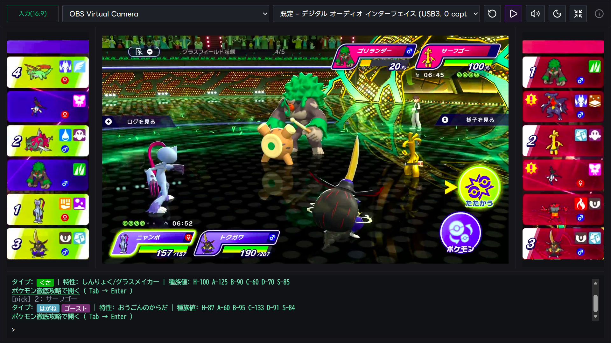

# pokemon-SnapCrop

**pokemon-SnapCrop** は、「Pokémon Champions」の対戦映像から自分と相手のパーティを自動で撮影し、表示する対戦補助アプリです。



## 公開 URL

[https://suisui-swimmy.github.io/pokemon-SnapCrop/](https://suisui-swimmy.github.io/pokemon-SnapCrop/)

## 推奨環境

- Windows / Google Chrome（Microsoft Edge では動作が重くなることがあります）
- 縦横比 16:9 の映像入力
- 名前推定・バトル統計を使う場合はインターネット接続

Switch の `設定` → `テレビ出力` → `画面の大きさを調整` は、`100%` に設定してください。

## 初期設定

1. 公開 URL を開くと、ブラウザから `カメラ` と `マイク` の使用許可を求められるので、`許可` を選びます。許可の確認が表示されない場合や、`許可しない`・`ブロック` を選んだ場合は、次の手順で設定を変更できます。

   - **Google Chrome**：アドレスバー左側の `サイト情報を表示` → `設定` → `権限` で、`カメラ` と `マイク` のスイッチを `オン` にして、ページを再読み込みします。
   - **Microsoft Edge**：アドレスバー左側の `サイト情報を表示` → `サイトの設定` で、`カメラ` と `マイク` を `許可` に設定して、ページを再読み込みします。

2. `映像入力` から映像の入力元を選びます。
3. `音声入力` から音声の入力元を選びます。OBS Virtual Camera は映像のみを出力するため、音声は別の入力元を選んでください。
4. コマンド入力欄に表示される「シングル / ダブル」を `Tab` / `Shift + Tab` で選び、`Enter` で確定します。選択はバトル統計の表示に使います。`Esc` で後回しにした場合や、変更したい場合は `stats rule` を入力してください。

> [!IMPORTANT]
> `マイク` が許可されていても、`音声` がブロックされていると音声は聞こえません。映像と音声を利用する場合は、ブラウザのサイト設定で `カメラ`・`マイク`・`音声` が許可されているか確認してください。
>
> 各設定の役割は次のとおりです。
>
> - `カメラ`：キャプチャ機器などから映像を取り込みます。
> - `マイク`：キャプチャ機器などから音声を取り込みます。
> - `音声`：取り込んだ音声をスピーカーやイヤホンで再生します。

映像が表示されない場合は `映像を開始` を押してください。接続した機器が一覧に表示されない場合は `一覧更新` を押してください。

## 自動で撮影する

16:9 の映像を選ぶと、自動撮影が有効になります。読み込み画面から選出画面・待機画面へ進むと、自分と相手のパーティを撮影します。次の対戦を検出すると、前の対戦の画像をリセットします。

撮影後は、次の情報も自動で表示します。

- 相手が対戦に出したポケモンを確認できると、相手のパーティ画像に `１`・`２`・`３`・`４` の選出番号が付きます。
- 相手のポケモンの名前を推定できた場合は、選出を確認したときにコマンド入力欄の上にそのポケモンのバトル統計を表示します。名前を確定できない場合は未確定のままにします。
- 相手のポケモンの瀕死を検出すると、パーティ画像の該当する枠を暗く表示します。
- 勝敗を確認できると、`[result] WIN` または `[result] LOSE` を表示します。通信切断など、通常の勝敗演出が出ない場合は判定できません。

自動撮影を止めるには `auto off`、再開するには `auto on` を入力して `Enter` を押します。

現在の待機状態や直前の撮影結果は `auto status` で確認できます。通常は撮影結果や操作が必要な案内を表示します。

撮り逃したときは、パーティが映っている間に `snap` を入力して撮影できます。撮影範囲を調整する場合は、次の「手動で撮影する・撮影範囲を調整する」の手順に従ってください。

## 手動で撮影する・撮影範囲を調整する

コマンドは画面下部のコマンド入力欄に入力し、`Enter` を押して実行します。

1. `映像入力` から入力元を選び、`auto off` で自動撮影を止めます。
2. `edit` を入力し、撮影範囲の枠をドラッグして位置や大きさを調整します。
3. `ready` を入力して調整を終えます。
4. パーティが映っているタイミングで `snap` を入力すると、左右両方を撮影します。

自分側だけ撮り直す場合は `snap my`、相手側だけ撮り直す場合は `snap enemy` を使います。調整後に自動撮影を再開する場合は `auto on` を入力してください。

何も入力せずに `Enter` を押す「空 Enter」は、`ready` の状態で自動撮影が停止しているときに左右両方を撮影します。`Ctrl + Enter` も自動撮影が停止しているときに使えます。自動撮影が有効な間は、誤操作を防ぐため、この2つのショートカットでは撮影しません。`snap` コマンドは自動撮影が有効な間も使えます。

## ポケモンのバトル統計を見る

コマンド入力欄にポケモンの名前を入力して `Enter` を押すと、選択したルールの最新統計を表示します。表示項目は「技・特性・持ち物・性格」の使用率です。これは相手が実際に使っている構成の確定情報ではありません。

- 入力中は候補が最大5件表示されます。
- `Tab` / `Shift + Tab` で候補を選び、`Enter` で統計を表示します。
- `Esc` で候補一覧を閉じられます。
- 日本語の変換中は候補一覧を表示しません。
- 相手の名前と選出番号が確定した場合にも、同じ統計を自動で表示します。

検索対象は、提供元から取得した一覧に最新の使用率が掲載されているポケモンです。選択中のシングル／ダブルに合わせて自動で絞り込みます。ルール未選択の間は、どちらかに掲載されているものを検索できます。通常種などと統計を共有するフォームも、提供元の対応に従って検索できます。英名やIDを直接入力した場合も同じ制限が適用されます。

一覧の読み込み中や取得失敗時は検索を利用できません。取得失敗時は `api retry` で再試行してください。一覧に掲載されていても、実際の統計取得時に通信エラーや掲載なしになる場合があります。

初期設定は技5件・特性全件・持ち物5件・性格3件、最低使用率0%です。次のコマンドで変更できます。

```text
stats rule
stats show 技 特性 持ち物 性格
stats top 技 5
stats top 性格 3
stats min 1
stats status
```

`stats show` は表示したい項目を表示順に指定します。`stats top <項目> all` で掲載分をすべて表示し、`stats min 0` で最低使用率の制限を解除できます。件数を増やしても提供元に掲載されている範囲までです。使用率はそのまま表示し、表示した項目だけで合計100%になるようには変更しません。

統計の見出しにはルールとデータの日付を表示します。フォーム別の統計がなく提供元で通常種などと共通になっている場合は、そのことも表示します。メガシンカポケモンは名前を入力して調べられますが、相手パーティ画像からの名前推定には使用しません。

ルールや表示設定を変えると、現在の相手画像に対応する自動表示を更新します。以前の試合や手入力で表示した結果は、そのときのルールのまま残ります。

同じ日本語名のフォームや特性などには「メガニャオニクス（オス）」「じんばいったい（ブリザポス）」のように区別用の補足を表示します。名前だけでは複数の候補がある場合は、Tabで候補を選んでください。翻訳が未対応・未確認の名称や翻訳対象外の項目は英語で表示します。

比較画像と統計は [Pokémon Champions Battle Data](https://championsbattledata.com/) から読み込みます。読み込み中は案内を表示し、掲載されていない場合と通信に失敗した場合を区別します。通信が復旧したら `api retry` で再試行できます。外部データが使えない間も、映像・撮影・左右画像の保持・選出番号の判定は利用できます。

## 選出番号・瀕死表示を直す

選出番号が違う場合は `pick set <選出番号> <枠番号>` で訂正できます。選出番号は1〜4、枠番号は相手のパーティ画像の上から1〜6です。

例えば `pick set 2 5` は、上から5番目のポケモンを「相手が2匹目に出したポケモン」として設定します。上から5番目のポケモンの選出番号だけを消したい場合は `pick clear 5` を使います。

瀕死によって暗くなった表示を解除する場合は `faint reset` を入力します。

## コマンド一覧

| コマンド | 短縮形 | 説明 |
| --- | --- | --- |
| `help` | — | 使えるコマンドの一覧を表示します。 |
| `status` | — | 現在のモードや映像・音声の状態を確認します。 |
| `edit` | `e` | 撮影範囲を調整します。 |
| `ready` | `r` / `Esc` | 撮影範囲の調整を終えます。 |
| `snap` / `snap both` | `s` | 左右両方のパーティ画像を更新します。 |
| `snap my` | `sm` | 自分側のパーティ画像だけを更新します。 |
| `snap enemy` | `se` | 相手側のパーティ画像だけを更新します。 |
| `snap clear` | — | 撮影済みのパーティ画像を消します。 |
| `auto on` | — | 自動撮影を有効にし、撮影待機状態にします。 |
| `auto off` | — | 自動撮影を止めます。 |
| `auto status` | — | 自動撮影の状態を確認します。 |
| `auto reset` | — | 自動検出をやり直します。 |
| `faint status` | — | 相手の瀕死表示の状態を確認します。 |
| `faint reset` | — | 相手の瀕死表示を解除します。 |
| `pick status` | `p` / `ps` | 相手の選出番号を確認します。 |
| `pick set <選出番号> <枠番号>` | `p <選出番号> <枠番号>` | 選出番号を訂正します。 |
| `pick clear <枠番号>` | `p clear <枠番号>` | 指定した枠の選出番号を消します。 |
| `stats rule` | — | `Tab` でシングル / ダブルを選び、`Enter` で確定します。 |
| `stats rule シングル` / `stats rule ダブル` | — | 統計のルールを直接指定します。 |
| `stats show <項目...>` | — | 技・特性・持ち物・性格から表示する項目を指定します。 |
| `stats top <項目> <件数\|all>` | — | 項目ごとの上位件数を指定します。件数は1以上の整数です。 |
| `stats min <使用率>` | — | 指定した使用率以上を表示します。0〜100で指定します。 |
| `stats status` | — | 現在の統計表示設定を確認します。 |
| `api status` | — | 外部データの読み込み状態を確認します。 |
| `api retry` | — | 読み込みに失敗した外部データを再試行します。 |
| `layout reset` | `lr` | 画面の配置を初期状態に戻します。 |
| `clear` | `cls` | コマンド入力欄の上に表示されたログを消します。 |
| `crop reset` / `crop reset both` | `cr` | 左右両方の撮影範囲を初期状態に戻します。 |
| `crop reset my` | — | 自分側の撮影範囲だけを初期状態に戻します。 |
| `crop reset enemy` | — | 相手側の撮影範囲だけを初期状態に戻します。 |

診断用の `debug` コマンドは、[技術・開発者向けガイド](docs/technical-guide.md#診断とログの保存)を参照してください。

## 設定と画像の保存

以下の設定はブラウザに保存されます。

- 撮影範囲の位置と大きさ
- 選択した映像・音声入力
- パーティ画像の表示幅やコマンド入力欄を含むパネルの高さ
- ライトテーマ・ダークテーマの選択（画面右上のアイコンで切り替え）
- バトル統計のルール・表示項目・件数・最低使用率

撮影した画像は、ページを再読み込みすると消えます。試合ログもページを閉じると消えます。調査のためにログや画像を保存する方法は、[診断とログの保存](docs/technical-guide.md#診断とログの保存)にまとめています。

外部から取得する比較画像や統計を、アプリの設定として保存することはありません。ブラウザが提供元の指定に従って一時保存する場合はあります。初回や期限切れの後は通信が必要になり、オフラインでの名前推定・統計表示は保証しません。

## 困ったときは

| 状況 | 試すこと |
| --- | --- |
| 映像が表示されない・入力機器が見つからない | サイト設定の `カメラ` が許可されているか確認し、`一覧更新` → `映像入力` で入力元を選択 → `映像を開始` の順に試してください。 |
| 映像は表示されるが音声が聞こえない | サイト設定の `マイク` と `音声` が許可されているか確認してください。アプリで選択している `音声入力` や、音量・ミュートの設定も確認してください。 |
| OBS Virtual Camera の音声が聞こえない | OBS Virtual Camera は映像のみを出力します。`音声入力` で別の入力元を選んでください。 |
| 自動撮影されない | 映像の縦横比が 16:9 か、Switch の `画面の大きさを調整` が `100%` かを確認し、`auto on` を入力してください。撮り逃した場合は `snap` で撮影できます。 |
| 撮影範囲がずれている | `edit` で調整し、`ready` で調整を終えてください。初期状態に戻すには `crop reset` を使います。 |
| 相手のポケモンの名前が表示されない | `api status` で比較画像の準備状況を確認し、通信失敗なら `api retry` を試してください。画像のない姿や推定できない枠は未確定になります。名前を入力して統計を調べることもできます。 |
| 統計のルールが未選択と表示される | `stats rule` を入力し、`Tab` で選んで `Enter` を押してください。 |
| 統計を取得できない | 通信状況を確認して `api retry` を入力してください。「掲載されていません」は通信失敗ではなく、そのルールの最新統計がない状態です。 |
| 「条件に合うデータなし」と表示される | `stats min 0` で最低使用率の制限を解除してください。 |

分からないことは、専用の[サポートチャット](https://chatgpt.com/g/g-69e6262f0edc8191b991191368c625c6-snapcrop-sahototiyatuto)で AI に相談できます。

## 技術・開発者向け資料

内部処理、使用技術、自動認識の判定条件、診断ログ、開発時の確認方法は、[技術・開発者向けガイド](docs/technical-guide.md)を参照してください。

## ライセンス

このリポジトリは MIT License の下で公開されています。ただし、ゲーム内の画像やポケモンの名称などに関する著作権は任天堂・クリーチャーズ・ゲームフリークに帰属しており、本ライセンスの適用対象外です。

このリポジトリは非公式のファンプロジェクトであり、任天堂・クリーチャーズ・ゲームフリークとは一切関係がありません。

画像・統計などの提供元とライセンスは、[データ提供元・クレジット](THIRD_PARTY_NOTICES.md)にまとめています。

## 連絡先

[X (@peixe0307)](https://x.com/peixe0307)
