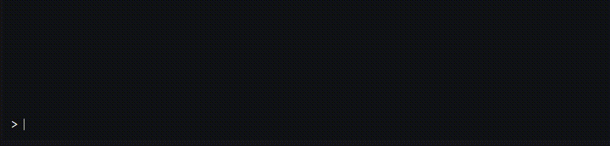

# pokemon-SnapCrop

**pokemon-SnapCrop** は、「Pokémon Champions」の対戦映像から自分と相手のパーティを自動で撮影 / 表示する Pokémon Champions 対戦補助アプリです。

## 公開URL
[https://suisui-swimmy.github.io/pokemon-SnapCrop/](https://suisui-swimmy.github.io/pokemon-SnapCrop/)

## 推奨環境

- Windows / Google Chrome（Microsoft Edge では動作が重くなることがあります）
- 縦横比 16:9 の映像入力
- Switch の「設定 → テレビ出力 → 画面の大きさを調整」は `100%` にしてください。

## 初期設定

1. 公開URLを開くと、自動で映像の開始を試みます。初回など、カメラの権限を求められた場合は許可してください。
2. 表示された映像が違う場合は、`映像入力` から映像の入力元を選びます。
3. 音も聞きたい場合は、`音声入力` から音声の入力元を選びます。マイクの権限を求められた場合は許可してください。入力元が選べない場合は、下記のサイト設定でマイクを許可し、`一覧更新` を押してください。OBS Virtual Camera は映像だけを出力するため、音声は別の入力元を選んでください。

カメラを許可済みの場合は、許可の確認を挟まず映像開始を試みます。保存済みの映像入力が利用できる場合は、その入力を使用します。音声の自動再生が止められた場合は、音量やミュートを操作すると再開を試みます。

権限の確認が出ない場合や、以前に拒否した場合は、次の手順で変更できます。

- **Google Chrome**：アドレスバー左側の `サイト情報を表示` → `設定` → `権限` で、`カメラ` と `マイク` のスイッチを `オン` にして、ページを再読み込みします。
- **Microsoft Edge**：アドレスバー左側の `サイト情報を表示` → `サイトの設定` で、`カメラ` と `マイク` を `許可` に設定して、ページを再読み込みします。

映像が再生されない場合は `映像を開始` を押してください。接続した機器が一覧に出ない場合は `一覧更新` を押してください。

## 自動で撮影する

16:9 の映像を選ぶと、自動で AUTO モードになります。読み込み画面から選出・待機画面へ進むと、自分と相手のパーティを撮影します。次の対戦を検知すると、前の対戦の画像をリセットします。

撮影後は、次の情報も自動で表示します。

- 相手が対戦に出したポケモンを確認できると、相手パーティ画像に `１` `２` `３` `４` の選出番号が付きます。
- 名前を推定できた相手については、選出を確認したときにコマンド入力欄の上へポケモンの情報を表示します。名前を確信できない場合は未確定のままにします。
- 相手の瀕死を検出すると、該当するパーティ画像を暗く表示します。
- 勝敗を確認できると、`[result] WIN` または `[result] LOSE` を1試合につき1回表示します。通信切断など、通常の勝敗演出が出ない場合は判定できません。

自動撮影を止めるには `auto off`、再開するには `auto on` を入力して Enter を押します。

撮り逃したときは、パーティが映っている間に `snap` を入力して撮影できます。撮影範囲を調整する場合は、次の手動撮影の手順を使ってください。

## 手動で撮影する・撮影範囲を調整する

コマンドは画面下部の入力欄に入力し、Enter を押して実行します。

1. 映像入力を選び、`auto off` で自動撮影を止めます。
2. `edit` を入力し、撮影範囲の枠をドラッグして位置や大きさを調整します。
3. `ready` を入力して調整を終えます。
4. パーティが映っているタイミングで `snap` を入力すると、左右両方を撮影します。

自分側だけ撮り直す場合は `snap my`、相手側だけなら `snap enemy` を使います。調整後に自動撮影へ戻す場合は `auto on` を入力してください。

何も入力せずに Enter を押す「空 Enter」は、`ready` 中・AUTO が OFF のときに左右両方を撮影します。`Ctrl + Enter` も AUTO が OFF のときに使えます。AUTO が ON の間は、誤操作を防ぐためこの2つのショートカットでは撮影しません。`snap` コマンドは AUTO が ON でも使えます。

## ポケモンの情報を見る

コマンド入力欄にポケモンの名前を入力して Enter を押すと、そのポケモンの情報を表示します。

- 入力中は候補が最大5件表示されます
- `Tab` / `Shift + Tab` で候補を選び、Enter で情報を表示します
- `Esc` で候補一覧を閉じられます
- 日本語の変換中は候補一覧を表示しません
- AUTO モード中は、認識できた相手選出の情報も自動で表示されます

## 選出番号・瀕死表示を直す

選出番号が違う場合は `pick set <選出番号> <枠番号>` で訂正できます。選出番号は1〜4、枠番号は相手パーティの上から1〜6です。

例えば `pick set 2 5` は、上から5番目のポケモンを「2匹目に出た相手」として設定します。番号だけ消したい場合は `pick clear 5` を使います。

瀕死による暗い表示を解除する場合は `faint reset` を入力します。

## コマンド一覧

| コマンド | 短縮形 | 説明 |
| --- | --- | --- |
| `help` | — | 使えるコマンド一覧を表示します |
| `status` | — | 現在のモードや映像・音声の状態を確認します |
| `edit` | `e` | 撮影範囲を調整します |
| `ready` | `r` / `Esc` | 撮影範囲の調整を終えます |
| `snap` / `snap both` | `s` | 左右両方のパーティ画像を更新します |
| `snap my` | `sm` | 自分側だけ更新します |
| `snap enemy` | `se` | 相手側だけ更新します |
| `snap clear` | — | 撮影済みのパーティ画像を消します |
| `auto on` | — | 自動撮影を有効にし、撮影待機状態にします |
| `auto off` | — | 自動撮影を止めます |
| `auto status` | — | 自動撮影の状態を確認します |
| `auto reset` | — | 自動検出をやり直します |
| `faint status` | — | 相手の瀕死表示の状態を確認します |
| `faint reset` | — | 相手の瀕死表示を解除します |
| `pick status` | `p` / `ps` | 相手の選出番号を確認します |
| `pick set <選出番号> <枠番号>` | `p <選出番号> <枠番号>` | 選出番号を訂正します |
| `pick clear <枠番号>` | `p clear <枠番号>` | 指定した枠の選出番号を消します |
| `layout reset` | `lr` | 画面の配置を初期状態に戻します |
| `clear` | `cls` | コマンド入力欄の上に表示されたログを消します |
| `crop reset` / `crop reset both` | `cr` | 左右両方の撮影範囲を初期状態に戻します |
| `crop reset my` | — | 自分側の撮影範囲だけ初期状態に戻します |
| `crop reset enemy` | — | 相手側の撮影範囲だけ初期状態に戻します |

診断用の `debug` コマンドは、[技術・開発者向けガイド](docs/technical-guide.md#診断とログの保存)を参照してください。

## 設定と画像の保存

以下の設定はブラウザに保存されます。

- 撮影範囲の位置と大きさ
- 選択した映像・音声入力
- パーティ画像の表示幅やコマンド欄の高さ
- ライト / ダークテーマ（ヘッダー右上のアイコンで切り替え）

撮影した画像は、ページを再読み込みすると消えます。試合ログもページを閉じた後には残りません。調査のためにログや画像を保存する方法は、[診断とログの保存](docs/technical-guide.md#診断とログの保存)にまとめています。

## 困ったときは

| 状況 | 試すこと |
| --- | --- |
| 映像が出ない・入力機器が見つからない | カメラ権限を確認し、`一覧更新` → 入力元の選択 → `映像を開始` を試してください |
| OBS の映像は出るが音が出ない | マイク権限を確認し、`音声入力` で別の音声入力元を選んでください |
| 自動撮影されない | 映像が16:9か、Switchの画面サイズが100%かを確認し、`auto on` を入力してください。撮り逃した場合は `snap` で撮影できます |
| 撮影範囲がずれている | `edit` で調整し、`ready` で調整を終えてください。初期状態に戻すには `crop reset` を使います |
| 相手の名前が表示されない | 名前を推定できない場合があります。コマンド入力欄に名前を入力して情報を調べられます |

分からないことは、専用の[サポートチャット](https://chatgpt.com/g/g-69e6262f0edc8191b991191368c625c6-snapcrop-sahototiyatuto)でAIに相談できます。

## 技術・開発者向け資料

内部処理、使用技術、自動認識の判定条件、診断ログ、開発時の確認方法は、[技術・開発者向けガイド](docs/technical-guide.md)を参照してください。

## ライセンス

このリポジトリは MIT License の下で公開されています。ただし、ゲーム内の画像やポケモンの名称などに関する著作権は 任天堂 / クリーチャーズ / ゲームフリークに帰属しており、本ライセンスの適用対象外です。

本リポジトリは非公式のファンプロジェクトであり、任天堂 / クリーチャーズ / ゲームフリークとは一切関係がありません。

使用データのライセンスと出典は、[THIRD_PARTY_NOTICES.md](THIRD_PARTY_NOTICES.md)を参照してください。

## 連絡先

[X (@peixe0307)](https://x.com/peixe0307)
